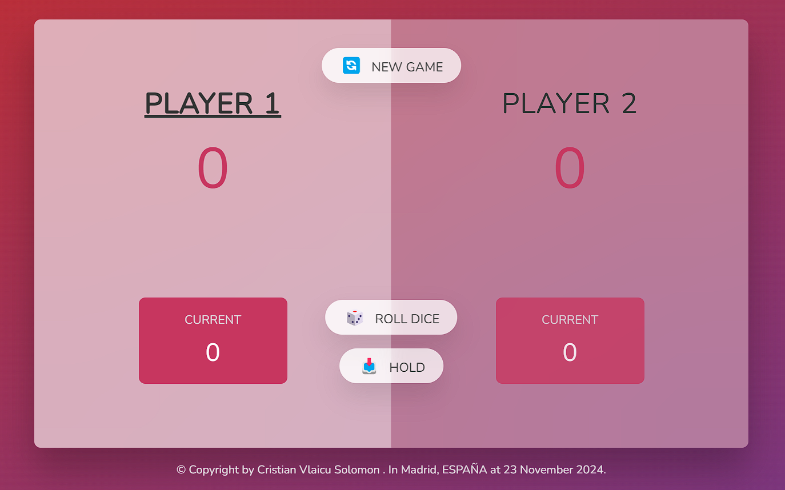
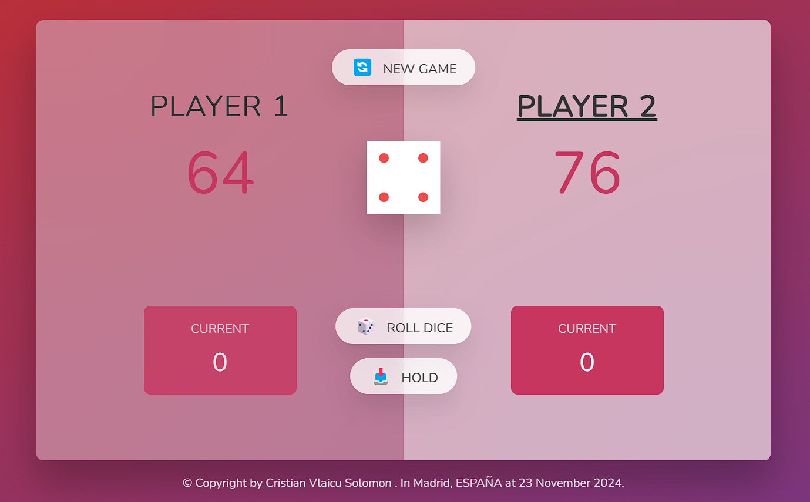
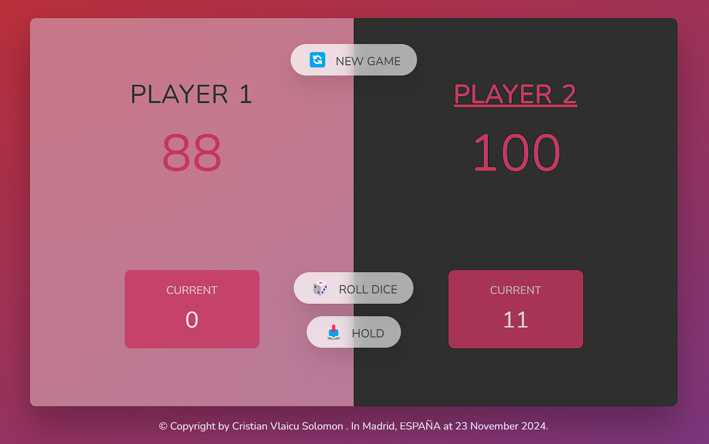

# What is this app??

&nbsp;&nbsp;👉 This is a simply game where tow players roll a dice by turn, and they acumulate points into a provisional score. They can keep rolling the dice until it turns 1. In that moment, the current player looses all provisional points and looses too the turn. But, if the current player want, he can Hold (pushing the "HOLD" button) that provisional score acumulated and put them into a stable score and keep adding points whenever he holds his provisional point. When the current player holds his pointsm he give the turn to the other player.

&nbsp;&nbsp;👉 When finishes this game? When on player acummulate 100 points in his stable score. In that case, game finishes, tell the winner and they can restart a new game pushing the "NEW GAME" button, where all scores turn to 0 and the player 1 starts the game, allways.

&nbsp;&nbsp;👉 You can run and play this game clonning the repository and run the index.html in Live Server, or download the zip file and open the index.html in your web browser. Or you can click on the Surge web link to use it directly on your browser: <a target="_blank" href="https://pig-game-vlaicu.netlify.app/" >https://pig-game-vlaicu.netlify.app/<b></b>

&nbsp;&nbsp;👉 I attach the flowchart and some screen prints here to can follow the logic flow of the app:

